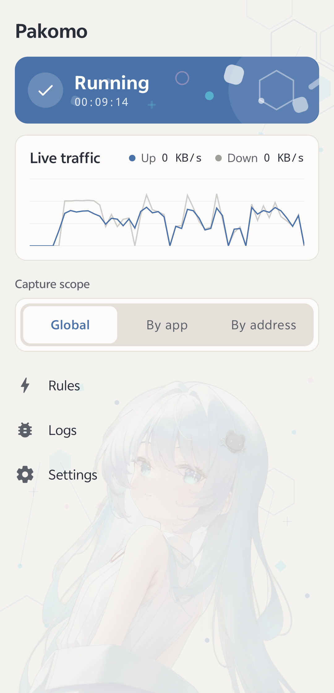
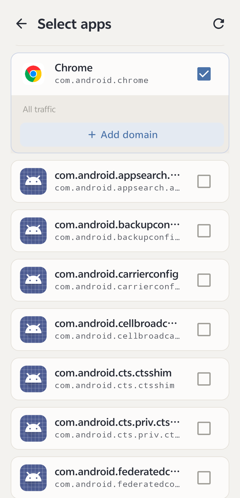
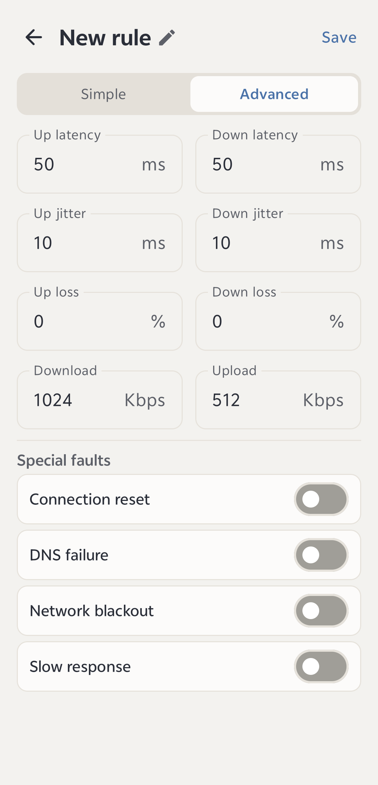
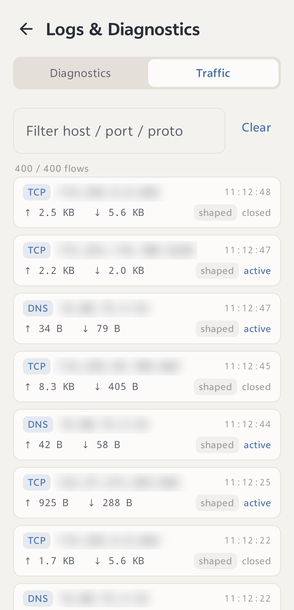

<div align="center">
  

  <h1>Pakomo</h1>

  <p>
    A local weak-network and fault-injection tool for selected apps and domains, built on Android <code>VpnService</code>.
  </p>

  <p>
    
    
    
    
    
  </p>

  <p>
    <a href="#introduction">Introduction</a>
    ·
    <a href="#runtime-screenshots">Runtime-Screenshots
</a>
    ·
    <a href="#features">Features</a>
    ·
    <a href="#quick-start">Quick Start</a>
    ·
    <a href="#project-structure">Project Structure</a>
    ·
    <a href="#how-it-works">How It Works</a>
    ·
    <a href="#documentation">Documentation</a>
    ·
    <a href="#notice">Notice</a>
  </p>

  <p>
    English · <a href="README.md">简体中文</a>
  </p>
</div>

## Introduction


Pakomo is a non-root Android weak-network and fault-injection tool. Through a local `VpnService`, Pakomo takes over the traffic of selected apps or domains and injects controlled network degradation and special faults on the device, to validate how clients behave under weak-network, fault, and late-response conditions.

All traffic handling happens on the device, never through an external proxy. Device TUN traffic is sent by the forwarding engine to an authenticated SOCKS5 relay that listens only on the loopback; the relay shapes or fault-injects matched traffic per connection and bypasses the rest as-is.

The forwarding engine has two alternative implementations, distinguished by Android build flavor. The relay logic and fault injection are completely identical, and they can coexist on the same device:

- **Kernel edition** (flavor `kernel`, the default, applicationId `com.alphynia.pakomo.kernel`): a self-developed, pure-Kotlin tun2socks kernel (`com.alphynia.pakomo.kernel`), with no native code and no NDK required to build.
- **Hev edition** (flavor `hev`, applicationId `com.alphynia.pakomo.hev`): uses the native `hev-socks5-tunnel` forwarding core.

Typical scenarios:

- Verify whether the original request is actually cancelled after a request times out, and whether a response to the original request arrives during retries;
- Observe how a client behaves under high latency, jitter, packet loss, and rate limiting;
- Reproduce special faults such as connection reset, DNS failure, network outage, and late response;
- Inspect, per connection, the actual traffic passing through the device to help locate problems.

## Runtime-Screenshots

| Home | Select apps | Rule editor | Traffic log |
|:---:|:---:|:---:|:---:|
|  |  |  |  |

## Features

- **Two forwarding engines**: the Kernel edition (pure-Kotlin kernel) and the Hev edition (hev native), functionally identical and able to coexist on the same device.
- **Takeover scope**: three mutually exclusive modes — global, selected apps, selected addresses (domains) — with domain subdomain matching.
- **Weak-network parameters**: fixed latency, jitter, packet loss, and up/down rate limiting, in a simple mode and an advanced mode (independent per-direction settings).
- **Special faults** (saved with the rule; multiple can be enabled at once):
  - Connection reset (TCP RST);
  - DNS failure (NXDOMAIN, SERVFAIL, REFUSED, timeout, with cache resistance);
  - Network outage (silent timeout, immediate failure);
  - Slow response (late response): holds the downstream response of a matched connection for a specified duration and then releases it at once, simulating the late response the client observes, with a "release small responses" threshold to let heartbeats and probes through.
- **Traffic log**: lists, per connection, the traffic passing through Pakomo (protocol, host, port, up/down bytes, whether held, whether shaped, status), filterable by host, port, and protocol.
- **Localization**: Simplified Chinese and English, switchable instantly in settings.
- **Theme**: a built-in, switchable Pako decorative theme.
- **Floating quick control**: instantly toggle takeover via a floating ball.
- **Diagnostics**: live runtime status, attribution-hit statistics, and raw Logcat output.
- **In-app self-update**: based on [novi](https://github.com/AlfWorks/Novi), with two-layer trust of a P-256 manifest signature + APK signer verification; when CI tags a `vX.Y.Z` release it automatically publishes a signed dual-track (kernel/hev) public update source, and an in-app dialog runs detect → download → verify → install.

## Quick Start

### Requirements

- JDK 17
- Android SDK 36
- NDK 28.2, needed only for the Hev edition (to compile the `hev-socks5-tunnel` native library); not required when building only the Kernel edition.
- Gradle Wrapper (provided with the repository)

### Preparing the hev forwarding core (Hev edition only)

The Kernel edition is pure Kotlin and does not need this step; you can go straight to "Building." Only when building the Hev edition do you need to initialize the submodules and prepare the vendored forwarding core before the first build:

```powershell
git submodule update --init --recursive
powershell -ExecutionPolicy Bypass -File .\scripts\prepare-third-party.ps1
```

`prepare-third-party.ps1` restores Git symbolic-link placeholders on Windows and applies the HEV attribution-preamble patch `patches/hev-attribution-preamble.patch` (the native change is maintained as a patch and is not committed into the submodule). The script is idempotent and can be re-run after `git submodule update`.

Linux and macOS support symbolic links, so restoring links is unnecessary, but the patch still needs to be applied:

```bash
git apply --directory=third_party/hev-socks5-tunnel patches/hev-attribution-preamble.patch
```

> The two implementations correspond to the Android product flavors `kernel` and `hev`; select an edition by including the corresponding flavor in the Gradle task names below.

### Debug builds

For local development and validation, invoke the two implementations separately:

```powershell
# Kernel edition (pure Kotlin, no native)
.\gradlew.bat :app:testKernelDebugUnitTest :app:lintKernelDebug :app:assembleKernelDebug
# Hev edition (hev native; complete "Preparing the hev forwarding core" first)
.\gradlew.bat :app:assembleHevDebug
```

The artifacts are `app/build/outputs/apk/kernel/debug/app-kernel-debug.apk` and `.../hev/debug/app-hev-debug.apk`. Debug builds are not obfuscated or resource-shrunk and are noticeably larger than release builds.

> The Hev edition must be invoked separately from the Kernel edition. The build script decides whether to compile the native library by "whether the task name contains `hev`"; mixing them in one invocation compiles the native code into the Kernel edition too.

### Using Pakomo in automated testing

Both the debug and release APKs of Pakomo include a stable automation control protocol. An automation project can adapt to this protocol in any language and test framework, using Pakomo as a programmable weak-network and fault injector. The repository does not provide a Python, Java, JavaScript, or specific-test-framework wrapper.

Release builds reject unauthenticated requests by default, and a token must be installed during device preparation. Debug builds may run without a token for developer diagnostics; once configured, both builds verify it.

The adapter layer inside your automation project is responsible for device selection, token injection, profile delivery, command sending, JSON parsing, timeouts, and `reset`/`stop` cleanup after a test failure. Pakomo provides the stable `start`, `update`, `status`, `reset`, and `stop` protocol semantics and structured responses. `scripts/automation-compare.sh` only demonstrates the internal diff flow between the Kernel and Hev flavors.

`automation-smoke.ps1` and `automation-smoke.sh` are only for Pakomo's own low-level protocol checks and are not integration examples. For Python, TypeScript, Java, and C++ call examples, and the complete fields, error codes, wait semantics, and security notes, see [Automation Control Interface](docs/automation-control_EN.md).

### Release builds

For distribution; you must configure signing yourself. Release builds enable R8 obfuscation and resource shrinking and are significantly smaller than debug builds:

```powershell
.\gradlew.bat :app:assembleKernelRelease   # Kernel edition
.\gradlew.bat :app:assembleHevRelease       # Hev edition
```

The artifacts are `app/build/outputs/apk/kernel/release/app-kernel-release.apk` and `.../hev/release/app-hev-release.apk`, with applicationIds `com.alphynia.pakomo.kernel` and `com.alphynia.pakomo.hev` respectively, able to coexist on the same device. CI (`.gitlab-ci.yml`) automatically builds and publishes both editions when a `vX.Y.Z` tag is pushed.

## Project Structure

```text
.
|-- app/src/main/java/com/alphynia/pakomo/
|   |-- core/            # Data models, input validation, UI-language enum
|   |-- data/            # Preference persistence, fault-config codec, app inventory
|   |-- kernel/          # Kernel edition: pure-Kotlin tun2socks kernel (IP/TCP/UDP, SOCKS5 client, connection reclamation)
|   |-- forwarding/      # SOCKS5 relay, shaping and fault policy, NIO reactor, traffic log
|   |-- shaping/         # Weak-network shaper (latency / jitter / loss / rate limiting)
|   |-- vpn/             # VpnService, tunnel config, connection attribution, runtime stats
|   |-- overlay/         # Floating-ball quick control
|   `-- ui/              # Jetpack Compose UI (screens / components / theme)
|-- app/src/main/res/                # Resources (icons, drawables, theme)
|-- third_party/hev-socks5-tunnel/   # Hev edition vendored forwarding core (git submodule)
|-- patches/                         # Hev edition HEV attribution-preamble patch
|-- scripts/                         # Third-party preparation and Pakomo dev self-check scripts
`-- docs/                            # Project documentation, organized by responsibility
```

## How It Works

```text
App → TUN → forwarding engine [ Tun2SocksEngine (Kernel · pure Kotlin) | hev-socks5-tunnel (Hev · native) ]
          → local authenticated SOCKS5 (Socks5Server) → protect()-ed socket → target server
```

- **Forwarding path**: device TUN traffic is forwarded by the engine (the self-developed Kotlin kernel `Tun2SocksEngine` for the Kernel edition, `hev-socks5-tunnel` for the Hev edition) to a SOCKS5 relay listening only on a random local port; every socket connecting out to a target server is first passed through `VpnService.protect()` and does not loop back into the TUN. After the two implementations, the relay, shaping, and fault logic (`Socks5Server`) is completely identical.
- **Per-app and per-domain attribution**: the forwarding engine passes through the original connection five-tuple (the attribution preamble; the HEV patch and the Kotlin `Socks5Client` behave identically), and attribution is resolved on the Kotlin side by `ConnectivityManager.getConnectionOwnerUid()`; domain matching uses the TLS SNI and target IPs learned from plaintext DNS, to cover QUIC and no-SNI connections.
- **Shaping and faults**: the relay decides per connection whether to shape or inject a fault; weak-network parameters and special faults are layered on the same data plane and are not applied redundantly.
- **Slow response**: on the downstream direction, a gate buffers the response of a matched connection and releases it at once when the time comes, yielding a constant lateness rather than shifting the server's whole streaming process.

> Pakomo does not decrypt TLS, so the minimum granularity of shaping and faults is the connection; it cannot delay only a single request within one HTTP/2 connection. For the granularity limits of HTTPS and QUIC, see [Limitations](docs/01-capabilities/limitations_EN.md).

## Documentation

The documentation is organized by responsibility; the index is [docs/README_EN.md](docs/README_EN.md). The authoritative list of capabilities is the [Capability Matrix](docs/01-capabilities/capability-matrix_EN.md).

- [Documentation overview](docs/README_EN.md)
- [Capability Matrix](docs/01-capabilities/capability-matrix_EN.md) · [Fault Models](docs/01-capabilities/fault-models_EN.md) · [Limitations](docs/01-capabilities/limitations_EN.md)
- [Principles & Boundaries](docs/00-overview/principles-and-boundaries_EN.md)
- [Architecture](docs/02-architecture/common-architecture_EN.md) (Kernel, Hev, data flow)
- [UI Specification](docs/03-product/ui-specification_EN.md) · [State Mapping](docs/03-product/state-mapping_EN.md)
- [Automation Control Interface](docs/automation-control_EN.md)
- [Acceptance Criteria](docs/06-testing/acceptance-criteria_EN.md) · [Measurement Methodology](docs/06-testing/measurement-methodology_EN.md)

## Notice

Pakomo is a network-testing tool, to be used for testing, research, and study only on networks and apps you are authorized to test, and must not be used for unauthorized traffic interception or interference.

- The forwarding core `hev-socks5-tunnel` is MIT-licensed and built from source.
- The SOCKS service listens only on a random local port with randomly generated credentials on each start.
- The `QUERY_ALL_PACKAGES` permission is used only to select installed apps within the takeover scope.
- The character "Pako" and its artwork are UI decoration, generated by Stable Diffusion (AI-generated content).

## License

Pakomo is licensed under the **GNU General Public License v3.0 or later** (`GPL-3.0-or-later`); see [LICENSE](LICENSE) for the full terms.

Copyright (C) 2026 AlfWorks

> This program is free software: you can redistribute it and/or modify it under the terms of the GNU General Public License as published by the Free Software Foundation, either version 3 of the License, or (at your option) any later version. This program is distributed in the hope that it will be useful, but **WITHOUT ANY WARRANTY**; without even the implied warranty of MERCHANTABILITY or FITNESS FOR A PARTICULAR PURPOSE. See the GNU General Public License for more details.

Third-party components retain their own licenses, all GPLv3-compatible: the forwarding core `hev-socks5-tunnel` (MIT) and the self-update library Novi (Apache-2.0). The character "Pako" and its artwork are outside the scope of this license (see "Notice" above).
